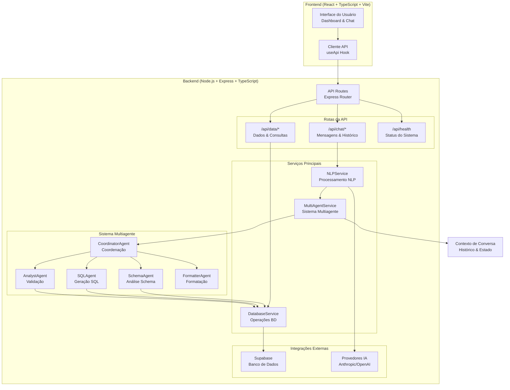
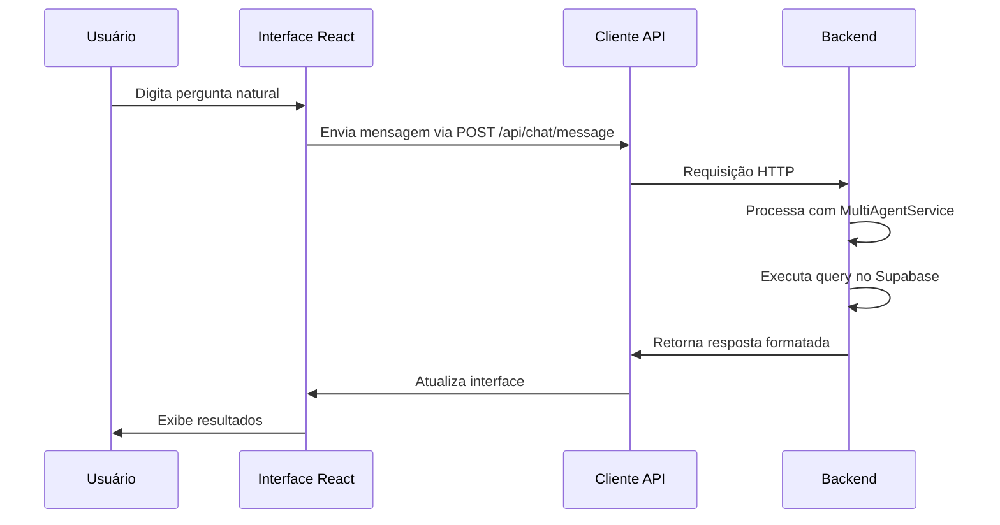
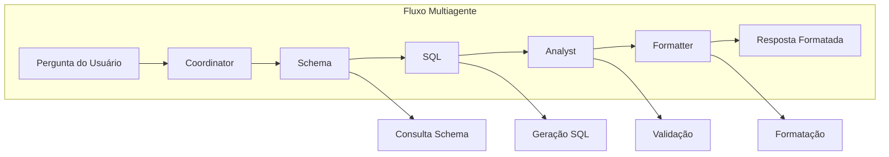
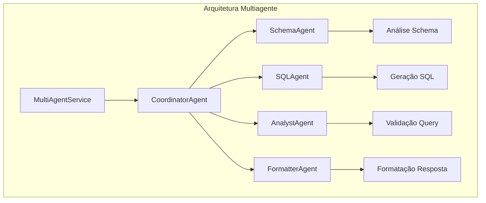
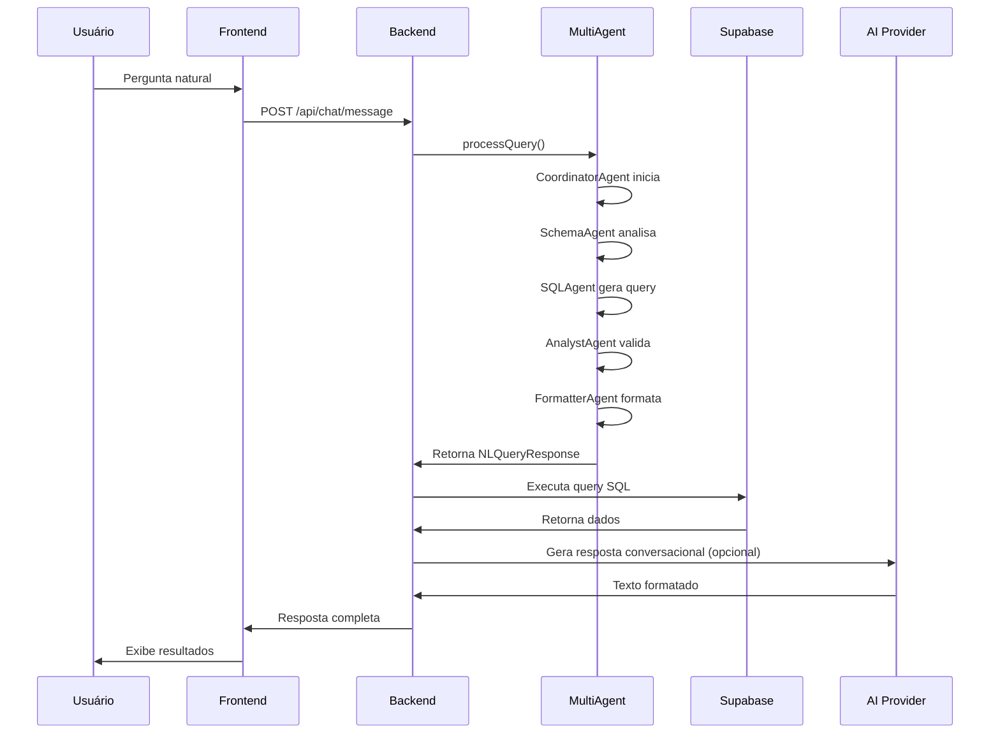

# AI Data Assistant - Arquitetura do Sistema

## Diagrama de Arquitetura



## Fluxo de Processamento Detalhado

### 1. Frontend (Interface do Usuário)


### 2. Backend - Sistema Multiagente


## Componentes Principais

### Frontend (`ai-data-assistant/frontend/`)
- **App.tsx**: Componente principal
- **Dashboard.tsx**: Visualização de dados
- **ChatInterface.tsx**: Interface de conversa
- **useApi.ts**: Hook para comunicação com API
- **api.ts**: Cliente HTTP

### Backend (`ai-data-assistant/backend/`)
- **index.ts**: Servidor Express principal
- **routes/chat.ts**: Endpoints de chat
- **routes/data.ts**: Endpoints de dados
- **services/nlp.ts**: Serviço NLP original
- **services/multiagent.ts**: Sistema multiagente
- **services/database.ts**: Operações de banco

### Sistema Multiagente


## APIs Disponíveis

### Chat API (`/api/chat/`)
- `POST /message`: Processa mensagem do usuário
- `GET /history/:sessionId`: Recupera histórico
- `DELETE /history/:sessionId`: Limpa histórico
- `GET /suggestions`: Sugestões de consulta

### Data API (`/api/data/`)
- `GET /tables`: Lista tabelas disponíveis
- `POST /query`: Executa consulta SQL
- `GET /sample/:table`: Dados de amostra

### Health API (`/api/health`)
- `GET /`: Status do sistema

## Integrações Externas

### Supabase (PostgreSQL)
- **Tabelas**: users, products, etc.
- **Autenticação**: API Key + URL
- **Operações**: SELECT, COUNT, filtros

### Provedores de IA
- **Anthropic Claude**: Principal (prioritário)
- **OpenAI GPT-4**: Fallback
- **Configuração**: API Keys via environment

## Fluxo de Dados Completo



## Características Técnicas

### Performance
- **Cache de Schema**: Para otimização
- **Contexto Persistente**: Histórico de conversa
- **Fallback Inteligente**: Multiagente → IA tradicional

### Confiabilidade
- **Validação Multiagente**: 4 agentes especializados
- **Sistema de Confiança**: Scores de 0.0 a 1.0
- **Fallback Automático**: Em caso de falha

### Escalabilidade
- **Arquitetura Modular**: Facilita extensões
- **Stateless Design**: APIs RESTful
- **Logs Detalhados**: Monitoramento completo

## Configuração de Ambiente

```bash
# Backend (.env)
ANTHROPIC_API_KEY=chave_anthropic
OPENAI_API_KEY=chave_openai
SUPABASE_URL=url_supabase
SUPABASE_KEY=chave_supabase

# Frontend (.env)
VITE_API_URL=http://localhost:3001
```

Este diagrama representa a arquitetura completa do AI Data Assistant após a implementação do sistema multiagente, mostrando como todos os componentes interagem para fornecer uma experiência robusta de análise de dados via linguagem natural.